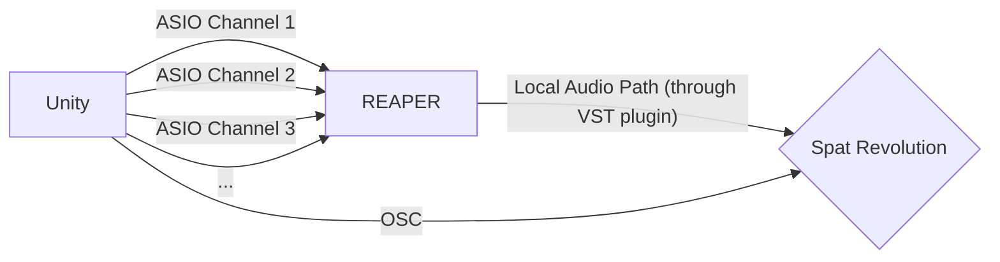

(Work in progress)

# Asio Audio for Unity
A simple package that simulates Audio Sources that send audio data through ASIO drivers using NAudio.
The developement was made using Unity 2022.3.19f1.

This package uses different frameworks:

- [UnityOSC](https://t-o-f.info/UnityOSC/) by thomasfredericks, to send Audio Sources positions through OSC protocol.
- [NuGetForUnity](https://github.com/GlitchEnzo/NuGetForUnity) by GlitchEnzo, to install the following NuGet package:
	- [NAudio](https://github.com/naudio/NAudio) by Mark Heath, an open-source .NET audio library. 

## Intended Workflow
The final idea of this package is to simulate the behaviour of Unity Audio Sources, with 2 main purposes:
- Adding the ability to send real-time position of Audio Sources through OSC protocol.
- Modifying the standard Unity audio output, and using the ASIO driver type to send audio data instead.

The idea behind is to use [REAPER](https://www.reaper.fm/) and [Spat Revolution](https://www.flux.audio/project/spat-revolution/) softwares to simulate Audio Sources on any output configuration.

REAPER will be used to get audio data using the ReaRoute ASIO driver and send the data to Spat Revolution.

Source positions will directly be sent using OSC to Spat Revolution.

## Getting started

### Outside Unity
A REAPER license and a Spat Revolution license (and account) are needed for this to work.

Download and install REAPER [here](https://www.reaper.fm/download.php).
> **Warning:** When installing, you will need to add the ReaRoute ASIO driver (which is not selected by default), otherwise you will not be able to retrieve ASIO data on REAPER.

Download install Flux Center (for Spat Revolution) [here](https://www.flux.audio/download/). 

### REAPER

Launch REAPER, and set the ASIO inputs (using ReaRoute ASIO) :

- Go to Options > Preferences, search for Device section and set the Audio System to Dummy Audio.
> We don't want any output audio device set on REAPER, because the output will be handled by Spat Revolution.

> **Warning:** The defined sample rate has to be the same as the sample rate defined in Unity (see [Unity Section](#unity)) and in Spat Revolution (see [Spat Revolution Section](#spat-revolution)).

- Set 4 empty tracks (using shortcut Ctrl+T) and arm the record clicking the  button.

For each track, change the record input () and set to ReaRoute inputs 1 to 4, if ReaRoute inputs are not available, check your REAPER installation and verify that ReaRoute ASIO has been checked for installation.

It should look like this:

Now that we configured REAPER ASIO inputs with 4 channels, we will now configure the output to Spat Revolution. For this we will need the Spat Revolution Send VST plugin:

- Open Flux Center and install Spat Revolution Send. This will install a VST plugin on your PC.
- Now on REAPER, go to Options > Preferences, search for VST section.
- On VST plug-in paths check that the path `%COMMONPROGRAMFILES%/VS3` is configured, click Re-scan... > Clear cache and re-scan VST paths for all plugins, it should add the plugin to REAPER.

### Spat Revolution

Open Flux Center and download Spat Revolution, the installation should be done automatically.

Launch Spat Revolution and go directly to Preferences. 

### Unity
