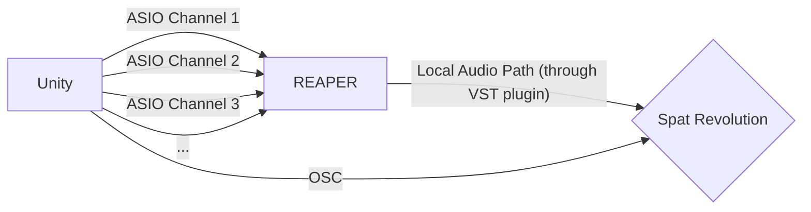

(Work in progress)

# Asio Audio for Unity
A simple package that simulates Unity Audio Sources that send audio data through ASIO protocol, and sends Audio Sources positions using OSC protocol.
The developement was made using Unity 2022.3.19f1.

This package uses different frameworks:

- [UnityOSC](https://t-o-f.info/UnityOSC/) by thomasfredericks, to send Audio Sources positions through OSC protocol.
- [NuGetForUnity](https://github.com/GlitchEnzo/NuGetForUnity) by GlitchEnzo, to install the following NuGet package:
	- [NAudio](https://github.com/naudio/NAudio) by Mark Heath, an open-source .NET audio library. 

## Intended Workflow
The purpose of this package is to simulate the behaviour of Unity Audio Sources, with 2 main goals:
- Adding the ability to send real-time position of Audio Sources through OSC protocol.
- Modifying the standard Unity audio output, and using the ASIO driver type to send audio data instead.

The idea behind is to use [REAPER](https://www.reaper.fm/) and [Spat Revolution](https://www.flux.audio/project/spat-revolution/) softwares to simulate spatialisation of Audio Sources on any output configuration.

REAPER will be used to get audio data using the ReaRoute ASIO driver, then to send the data to Spat Revolution.

Source positions will directly be sent using OSC to Spat Revolution.

## Getting started

### Outside Unity
A REAPER license and a Spat Revolution license (and account) are needed for this to work.

Download and install REAPER [here](https://www.reaper.fm/download.php).
> **Warning:** On the REAPER installer, make sure you add the ReaRoute ASIO driver (which is not selected by default), otherwise you will not be able to retrieve ASIO data on REAPER.

Download install Flux Center (for Spat Revolution) [here](https://www.flux.audio/download/). 

### REAPER

Launch REAPER, and set the ASIO inputs (using ReaRoute ASIO) :

- Go to *Options > Preferences*, search for *Device* section and set the Audio System to Dummy Audio.
	> We don't want any output audio device set on REAPER, because the output will be handled by Spat Revolution.

	> **Warning:** The defined sample rate has to be the same as the sample rate defined in Unity (see [Unity Section](#unity)) and in Spat Revolution (see [Spat Revolution Section](#spat-revolution)). This should be defined according to which sample rates are supported by the output device.

- Set 4 empty tracks (using shortcut Ctrl+T) and arm the record by clicking the  button.

- For each track, change the record input () and set to ReaRoute inputs 1 to 4, if ReaRoute inputs are not available, check your REAPER installation and verify that ReaRoute ASIO has been checked while installing REAPER.

It should look like this:

**REAPER is now ready to recieve audio data via ASIO from Unity.**

Now that we configured REAPER ASIO inputs with 4 channels, we will now configure the output to Spat Revolution. For this we will need the **Spat Revolution Send VST** plugin:

- Open Flux Center and install Spat Revolution Send. This will install a VST plugin on your PC.

- Now on REAPER, go to *Options > Preferences*, search for *VST* section.

- On VST plug-in paths check that the path `%COMMONPROGRAMFILES%/VS3` is configured, click *Re-scan... > Clear cache and re-scan VST paths for all plugins*, it should add the plugin to REAPER.

- Check if the VST plugin is available. To do this, select a track, click on the FX button (NOT THE IN FX), and search for `VST3: Spat Revolution - Send (FLUX) (64ch)`:

- On the Spat Revolution Send VST window, enable Local Audio Path to send audio data to Spat:

- Do the 2 last steps on each track created (from "Check if the VST plugin is available").

### Spat Revolution

Open Flux Center and download Spat Revolution, the installation should be done automatically.

- Launch Spat Revolution and go directly to the *Preferences* tab. 

- **For audio data:** Go to IO Hardware, set the desired output device (must be an ASIO device), and configure the sample rate and the block size so it matches the available properties of the device. The two properties must also match the properties set in REAPER about the Dummy Audio device, to avoid any unwanted audio artifact.

 

-  **For audio source position:** Go to OSC Main, and be sure that OSC is enabled by ticking the first button. Then, on OSC Connections, add a new connection: `input | Spat Revolution - Plugins`, and set up the IP address to localhost (127.0.0.1), and the port 8100.

 

- Once done, go to the *Setup* tab, and you should already see 4 inputs on the Input line, corresponding to the 4 tracks set on REAPER.
	>If you don't see them, refer to the [REAPER](#reaper) section to set them up.

- Do the following:
	- Add 4 source transcoders on the Source Transcoder line, connect them to the 4 tracks, and verify that Output Configuration is set to Mono on each transcoder.
	- Add 4 sources on the Source line, connect them to the 4 source transcoders (they should have a Mono configuration).
	- Add a room on the Room line, specify the output configuration wanted, and connect each created source above to this room.
	- Finally, add an output on the Output line and connect it to the created room above (it should automatically add an intermediary master component on the Master line).
- This should be set as follows:

You can see on the *Room* tab the final configuration of the room and sources.

### Unity

Once REAPER and Spat Revolution are set, we will open the package on a Unity project. To do this:

- Create a project or open an existing project using Unity Hub. A 2022.3 version should work fine.

- Download and import the Unity Package to the project (see Releases). Once done, open the Example Scene on `Assets/AsioAudioUnity/Example/AsioAudioScene.unity`.

- Identify the ASIO Audio Sources on the Scene, and pick one. On the Inspector tab, select the component [CustomAsioAudioSource](/docs/Audio%20Components/CustomAsioAudioSource.md) and verify that `PlayOnEnable` is set to `true`.

- Identify the OSC Manager object on the Scene, and verify on the `OSC` component that the `OutIP` and `OutPort` properties match the ones set on Spat Revolution (respectively by default 127.0.0.1 and 8100).

- Click Play, and see if audio data is transmitted to REAPER. The REAPER track that should get data is the one identified with the `TargetOutputChannel` on the [CustomAsioAudioSource](/docs/Audio%20Components/CustomAsioAudioSource.md) component, which will point to the corresponding ReaRoute input. 
	> Example: On Unity, if a [CustomAsioAudioSource](/docs/Audio%20Components/CustomAsioAudioSource.md) has its `PlayOnEnable` property ticked, and its `TargetOutputChannel` property set to 3, the REAPER track identified by input ReaRoute 3 should get the data when playing the scene.

## Documentation

The full documentation is available [here](/docs).

#### Audio Components

[AsioAudioManager](/docs/Audio%20Components/AsioAudioManager.md)

[CustomAsioAudioSource](/docs/Audio%20Components/CustomAsioAudioSource.md)

#### OSC Components

[RoomPositionOsc](/docs/OSC%20Components/RoomPositionOsc.md)

[SourcePositionOsc](/docs/OSC%20Components/SourcePositionOsc.md)

#### How To

[Setup ASIO Audio Environment](/docs/SetupAsioAudioEnvironment.md)

[Setup ASIO Audio Sources In Scene](/docs/SetupAsioAudioSourcesInScene.md)

[Setup ASIO Audio Sources From Scene With Audio Sources](/docs/SetupFromSceneWithAudioSources.md)

[Setup OSC Environment](/docs/SetupOscEnvironment.md)