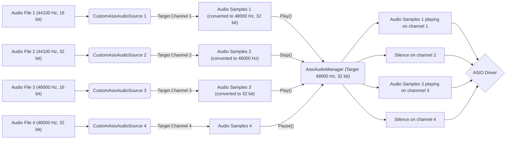

## Setup ASIO Audio Environment

If you begin in using the AsioAudioUnity plugin, you can start here by following this part of the documentation.

### Intended ASIO audio workflow

The intended working operation of this package is based on how Unity Audio Sources work. It tends to reproduce their behaviour with some additional parameters.

The component [CustomAsioAudioSource](/docs/Audio%20Components/CustomAsioAudioSource.md) is the base component designed to replace the Unity Audio Source, with similar properties:
- Property `AudioClip` from Audio Source is replaced with `AudioFilePath`.
- Property `Volume` has the same name and behaviour.
- Property `PlayOnAwake` from Audio Source is replaced with `PlayOnEnable` (triggers `Play` from `OnEnable` instead from `Awake`).
- Property `Loop` has the same name and behaviour.

However, for all the [CustomAsioAudioSource](/docs/Audio%20Components/CustomAsioAudioSource.md) components to work, we need an [AsioAudioManager](/docs/Audio%20Components/AsioAudioManager.md) component on scene.

There is multiple reasons that justify the need of this component:
- [CustomAsioAudioSource](/docs/Audio%20Components/CustomAsioAudioSource.md) components can't actually send audio samples data independently from each other, so a manager is needed to regroup them together to send a multiplexed audio samples object on the ASIO driver.

- Audio samples from [CustomAsioAudioSource](/docs/Audio%20Components/CustomAsioAudioSource.md) components need to respect a certain audio sample rate and bit depth (bits per sample), so a manager is needed to tell [CustomAsioAudioSource](/docs/Audio%20Components/CustomAsioAudioSource.md) components the potential conversion to make them work.

- ASIO drivers support a limited number of input channels, and each [CustomAsioAudioSource](/docs/Audio%20Components/CustomAsioAudioSource.md) component has be played on a specific channel, so a manager is needed to handle verification of [CustomAsioAudioSource](/docs/Audio%20Components/CustomAsioAudioSource.md) `TargetOutputChannel` properties (validity and no duplicate).

Here is a concrete example of the ASIO audio workflow:

### Creating the ASIO Audio Manager

**Before adding any [CustomAsioAudioSource](/docs/Audio%20Components/CustomAsioAudioSource.md) component , please verify that an [AsioAudioManager](/docs/Audio%20Components/AsioAudioManager.md) component is already in scene.**

To add an [AsioAudioManager](/docs/Audio%20Components/AsioAudioManager.md) component on scene, you can go multiple ways:

1. Use prefab: A prefab named `ASIO Audio Manager` is present on the `Assets` folder, at `Assets/AsioAudioUnity/Prefabs/ASIO Audio Manager.prefab`, you can simply drag and drop this prefab on scene.
2. Setup GameObject: You can add a GameObject with an [AsioAudioManager](/docs/Audio%20Components/AsioAudioManager.md) component on scene by going to *GameObject > AsioAudioUnity > ASIO Audio Manager*.

Once the [AsioAudioManager](/docs/Audio%20Components/AsioAudioManager.md) is put in scene, you can set the `AsioDriverName` field with the ASIO driver name you want to connect to. If the name is correctly set, you shouldn't have any errors on the console. Moreover you can see connection status by setting the `DisplayInfoOnGameWindow` property to `true` (or ticking the corresponding box in the Inspector).

As channels are limited on ASIO drivers, you can see how many channels are available on the ASIO driver you specified by looking at the `AsioInputDriverChannelCount` property when starting the application.

Finally, make sure to correctly set `TargetSampleRate` and `TargetBitsPerSample` properties so it matches the available sample rate and bit depth of the ASIO driver, or you will get errors.

### Setup ASIO Audio Sources

If you don't have any Unity Audio Source component in your scene, refer to [Setup ASIO Audio Sources In Scene](/docs/SetupAsioAudioSourcesInScene.md).
If you have Unity Audio Source components in your scene, refer to [Setup ASIO Audio Sources From Scene With Audio Sources](/docs/SetupFromSceneWithAudioSources.md).