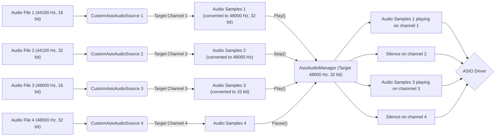

## Setup ASIO Audio Sources From Scene Without Audio Sources

If you want to start from scratch from an empty scene or a scene without any Audio Sources, you can follow this part of the documentation.

### Intended ASIO audio workflow

The intended working operation of this package is based on how Unity Audio Sources work. It tends to reproduce their behaviour with some additional parameters.

The component [CustomAsioAudioSource](/docs/Audio%20Components/CustomAsioAudioSource.md) is the base component of an ASIO Audio Source. It is concretely a replacement of the Unity Audio Source, with similar properties:
- Property `AudioClip` from Audio Source is replaced with `AudioFilePath`.
- Property `Volume` has the same name and behaviour.
- Property `PlayOnAwake` from Audio Source is replaced with `PlayOnEnable` (triggers `Play` from `OnEnable` instead from `Awake`).
- Property `Loop` has the same name and behaviour.

**For the ASIO Audio Sources to work, we need an [AsioAudioManager](/docs/Audio%20Components/AsioAudioManager.md) component on scene.**

There is multiple reasons that justify the need of this component:
- ASIO Audio Sources can't actually send audio samples data independently from each other.
    - A manager is needed to regroup them together to send a multiplexed audio samples object on the ASIO driver.

- Audio samples from ASIO Audio Sources need to respect a certain audio sample rate and bit depth (bits per sample).
    - A manager is needed to tell ASIO Audio Sources the potential conversion to make them work.

- ASIO drivers support a limited number of input channels, and each ASIO Audio Source has be played on a specific channel.
    - A manager is needed to handle verification of ASIO Audio Sources target channel (validity and no duplicate).

Here is a concrete example of the ASIO audio workflow:

### Creating the ASIO Audio Manager

To add an [AsioAudioManager](/docs/Audio%20Components/AsioAudioManager.md) component on scene, you can go multiple ways.

1. Use prefab: A prefab named `ASIO Audio Manager` is present on the `Assets` folder, at `Assets/AsioAudioUnity/Prefabs/ASIO Audio Manager.prefab`, you can simply drag and drop this prefab on scene.
2. Setup Component: You can add an [AsioAudioManager](/docs/Audio%20Components/AsioAudioManager.md) component on any GameObject on scene by selecting it, right click and go to `AsioAudioUnity > ASIO Audio Manager`.

How to know how many channels are available on driver

### Creating a new ASIO Audio Source

1) Use prefab
2) Setup Component 

Set the properties

### Setup with OSC position